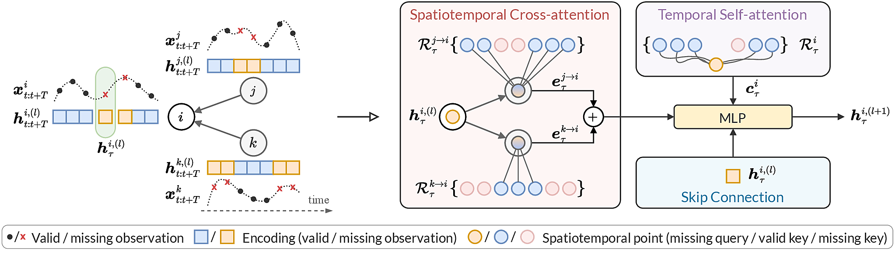

# Learning to Reconstruct Missing Data from Spatiotemporal Graphs with Sparse Observations (NeurIPS 2022)

[](#)
[](https://arxiv.org/pdf/2205.13479)
[](https://arxiv.org/abs/2205.13479)

This repository contains the code for the reproducibility of the experiments presented in the paper "Learning to Reconstruct Missing Data from Spatiotemporal Graphs with Sparse Observations" (NeurIPS 2022). We propose a graph neural network that exploits a novel spatiotemporal attention to impute missing values leveraging only (sparse) valid observations.

**Authors**: [Ivan Marisca](mailto:ivan.marisca@usi.ch), [Andrea Cini](mailto:andrea.cini@usi.ch), Cesare Alippi

## SPIN in a nutshell

Spatiotemporal graphs are often highly sparse, with time series characterized by multiple, concurrent, and even long sequences of missing data, e.g., due to the unreliable underlying sensor network. In this context, autoregressive models can be brittle and exhibit unstable learning dynamics. The objective of this paper is, then, to tackle the problem of learning effective models to reconstruct, i.e., impute, missing data points by conditioning the reconstruction only on the available observations. In particular, we propose a novel class of attention-based architectures that, given a set of highly sparse discrete observations, learn a representation for points in time and space by exploiting a spatiotemporal diffusion architecture aligned with the imputation task. Representations are trained end-to-end to reconstruct observations w.r.t. the corresponding sensor and its neighboring nodes. Compared to the state of the art, our model handles sparse data without propagating prediction errors or requiring a bidirectional model to encode forward and backward time dependencies.

<div align=center>
	
	<p align=left style="color: #777">Example of the sparse spatiotemporal attention layer. On the left, the input spatiotemporal graph, with time series associated with every node. On the right, how the layer acts to update target representation (highlighted by the green box), by simultaneously performing inter-node spatiotemporal cross-attention (red block) and intra-node temporal self-attention (violet block).</p>
</div>

---

## Directory structure

The directory is structured as follows:

```
.
├── config/
│   ├── imputation/
│   │   ├── brits.yaml
│   │   ├── grin.yaml
│   │   ├── saits.yaml
│   │   ├── spin.yaml
│   │   ├── spin_h.yaml
│   │   └── transformer.yaml
│   └── inference.yaml
├── experiments/
│   ├── run_imputation.py
│   └── run_inference.py
├── spin/
│   ├── baselines/
│   ├── imputers/
│   ├── layers/
│   ├── models/
│   └── ...
├── conda_env.yaml
└── tsl_config.yaml

```

## Installation

We provide a conda environment with all the project dependencies. To install the environment use:

```bash
conda env create -f conda_env.yml
conda activate spin
```

## Configuration files

The `config/` directory stores all the configuration files used to run the experiment. `config/imputation/` stores model configurations used for experiments on imputation.

## Python package `spin`

The support code, including models and baselines, are packed in a python package named `spin`.

## Experiments

The scripts used for the experiment in the paper are in the `experiments` folder.

* `run_imputation.py` is used to compute the metrics for the deep imputation methods. An example of usage is

	```bash
	conda activate spin
	python ./experiments/run_imputation.py --config imputation/spin.yaml --model-name spin --dataset-name bay_block
	```

* `run_inference.py` is used for the experiments on sparse datasets using pre-trained models. An example of usage is

	```bash
	conda activate spin
	python ./experiments/run_inference.py --config inference.yaml --model-name spin --dataset-name bay_point --exp-name {exp_name}
	```

## Bibtex reference

If you find this code useful please consider to cite our paper:

```
@article{marisca2022learning,
  title={Learning to Reconstruct Missing Data from Spatiotemporal Graphs with Sparse Observations},
  author={Marisca, Ivan and Cini, Andrea and Alippi, Cesare},
  journal={arXiv preprint arXiv:2205.13479},
  year={2022}
}
```
 